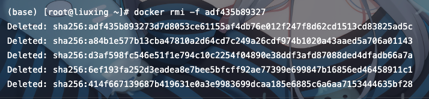

# Docker common command

## 一、Operational Image

### 1.1 View Image List

```shell
   docker images
```
### 1.2 Search Image

Command Format:docker search imageName，eg：
```shell
   docker search mysql   # mysql is the image name
```

### 1.3 Pull Image

Command Format:docker pull imageName，eg：
```shell
    docker pull mysql  # mysql is the image name
```
Command Format:docker pull imageName:Tag，eg：
```shell
    docker pull mysql:5.7  # mysql is the image name，5.7 It's tag
```
### 1.4 Delete Image
Command Format:docker rmi -f imageName/imageID，eg：
```shell
    docker rmi -f mysql # mysql is the image name
```
```shell
    docker rmi -f adf435b89327 # adf435b89327 is the image ID
```


### 1.5 Saving Images 
Command format: docker save image name/image ID -o save location and name of the image, eg: 
```shell 
    Docker Save Revision -o/root/rrr.tar 
``` 
```shell 
    Docker save 0e403e3816e8-o/root/ttt.tar
``` 
### 1.6 Loading a Saved Image 
Command format: docker load -i location of image saving file, eg: 
```shell 
    Docker load -i/root/rrr.tar 
``` 
## 二. Handling of containers 
### 2.1 Viewing the Container List 
```shell 
    docker ps #View all containers 
```    
```shell 
    docker ps -a #View all containers-----including running and stopped containers 
``` 
### 2.2 Creating a Container 
Command format: docker run -it -d --name alias-p host machine port: container port -v host machine file storage location: file location in container mirror name:Tag /bin/bash, eg: 
```shell 
    docker run-it-d-name tomcat-p 8080:8080 tomcat:latest/bin/bash 
``` 
Parameter Meaning: 
-it means to start interactively with the container 
-d means the container can run in the background (daemon) 
--name Name of the container to run /bin/bash interaction path 
-p Maps the container 's port to the host, through which the internal port is accessed 
-v Mount the specified folder in the container to the corresponding location of the host machine 
### 2.3 Stop Vessel 
Command format: docker stop container name/container ID, eg: 
```shell 
    docker stop tomcat 
``` 
```shell 
    Loader stop 0a1cd555148e 
``` 
### 2.4 Deleting Containers 
```shell 
    docker rm -f containerName/containerID # Delete a container 
``` 
```shell 
    docker rm -f containerName/containerID containerName/containerID containerName/containerID 
    # Delete multiple containersSpaces separate the container names or container IDs to be deleted
```
``` shell 
    docker rm -f $(docker ps -aq) # Delete all containers 
``` 
### 2.5 Entry into vessel 
```shell 
    docker attach containerID/containerName 
``` 
If you are prompted that you do not have permission, remember to add sudo before the command
