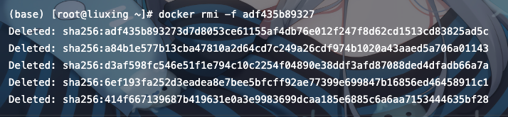

# docker 常用命令

## 一、操作镜像

### 1.1 查看镜像列表

```shell
   docker images
```
### 1.2 搜索镜像

命令格式：docker search 镜像名，eg：
```shell
   docker search mysql   # mysql是镜像名
```

### 1.3 拉取镜像

命令格式：docker pull 镜像名，eg：
```shell
    docker pull mysql  # mysql是镜像名
```

命令格式：docker pull 镜像名:Tag，eg：
```shell
    docker pull mysql:5.7  # mysql是镜像名 5.7是Tag
```
### 1.4 删除镜像
命令格式：docker rmi -f 镜像名/镜像ID，eg：
```shell
    docker rmi -f mysql # mysql是镜像名
```
```shell
    docker rmi -f adf435b89327 # adf435b89327 是镜像ID
```


### 1.5 保存镜像
命令格式：docker save 镜像名/镜像ID -o 镜像保存位置与名字，eg：
```shell
    docker save redis -o /root/rrr.tar
```

```shell
    docker save 0e403e3816e8 -o /root/ttt.tar
```
### 1.6 加载保存的镜像
命令格式：docker load -i 镜像保存文件位置，eg：
```shell
    docker load -i /root/rrr.tar
```
## 二、操作容器

### 2.1 查看容器列表
```shell
    docker ps # 查看所有容器
```
```shell
    docker ps -a # 查看所有容器 -----包含正在运行和已停止的容器
```
### 2.2 创建容器
命令格式：docker run -it -d --name 别名 -p 宿主机端口:容器端口 -v 宿主机文件存储位置:容器内文件位置 镜像名:Tag /bin/bash ，eg：
```shell
    docker run  -it  -d  --name  tomcat  -p 8080:8080 -v  tomcat:latest /bin/bash
```
参数含义：
-it 表示与容器进行交互式启动
-d 表示可后台运行容器 （守护式运行）  
--name 给要运行的容器 起的名字  
/bin/bash  交互路径
-p 将容器的端口映射到宿主机上，通过宿主机访问内部端口
-v 将容器内的指定文件夹挂载到宿主机对应位置
### 2.3 停止容器
命令格式：docker stop 容器名/容器ID，eg：
```shell
    docker stop tomcat
```
```shell
    docker stop 0a1cd555148e
```
### 2.4 删除容器
```shell
    docker rm -f 容器名/容器ID # 删除一个容器
```
```shell
    docker rm -f 容器名/容器ID 容器名/容器ID 容器名/容器ID 
    # 删除多个容器 空格隔开要删除的容器名或容器ID
```
```shell
    docker rm -f $(docker ps -aq)  # 删除全部容器
```
### 2.5 进入容器
```shell
    docker attach 容器ID/容器名
```
执行以上命令时如果提示没有权限，记得在命令前加sudo
