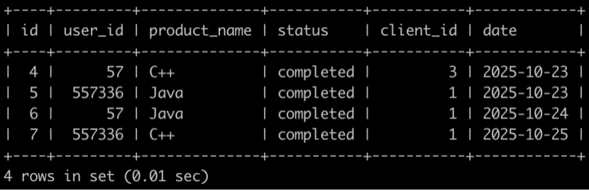

## 第一题

1.有很多同学在牛客购买课程来学习，购买会产生订单存到数据库里。
有一个订单信息表(order_info)，简况如下:


第1行表示user_id为557336的用户在2025-10-10的时候使用了client_id为1的客户端下了C++课程的订单，但是状态为没有购买成功。
第2行表示user_id为230173543的用户在2025-10-12的时候使用了client_id为2的客户端下了Python课程的订单，状态为购买成功。
。。。
最后1行表示user_id为557336的用户在2025-10-25的时候使用了client_id为1的客户端下了C++课程的订单，状态为购买成功。

请你写出一个sql语句查询在2025-10-15以后，同一个用户下单2个以及2个以上状态为购买成功的C++课程或Java课程或Python课程的订单信息，并且按照order_info的id升序排序，以上例子查询结果如下:



解析:
id为4，6的订单满足以上条件，输出它们的对应的信息;
id为5，7的订单满足以上条件，输出它们的对应的信息;
按照id升序排序

```sql
select * FROM order_info where user_id IN (select user_id from order_info WHERE
                                          date >='2025-10-15'
                                          and product_name in ("C++","Java","Python")
                                          and status = 'completed'
                                          Group by user_id
                                          HAVING COUNT(user_id)>=2)
                                          and date >='2025-10-15'
                                          and product_name in ("C++","Java","Python")
                                          and status = 'completed'
                                          order by id
```

## 第二题
2.给一个正整数n ( 1 <= n <=1e18 )，现在牛牛想得到一个不可重集合（该集合的元素不能重复），不重复地利用这个集合中的数进行加和可以表示出的1 ~ n所有数。牛牛想知道这个集合大小的最小值为多少？

例如n = 6 的时候答案为 3 ，所需要的集合为(1,2,4)。
其中1~6  的表示方法如下：

1 = 1

2 = 2 

3 = 1 + 2

4 = 4

5 = 1 + 4

6 = 2 + 4


注意：在表示一个数时，集合中的元素不能重复使用。例如4 = 2 + 2这是不符合要求的表示方法。

```java
import java.util.*;

public class Solution {
    /**
     * 代码中的类名、方法名、参数名已经指定，请勿修改，直接返回方法规定的值即可
     *
     * 返回集合大小的最小值
     * @param n long长整型 
     * @return int整型
     */
    public int getSize (long n) {
        // write code here
        int count=0;
        while(n>0)
        {
           n=n/2;
           count++;
        }
        return count;
    }
}
```
## 第三题

3.一个数列里有若干个 ，假设现在  的个数分别是 ，请问至少要有多少个  才能使数列四舍五入后的平均值不小于 。

```java
import java.util.*;

public class Main{
    public static void main(String args[]){
        Scanner sc = new Scanner(System.in);
        long a = sc.nextLong();
        long b = sc.nextLong();
        long c = sc.nextLong();
        long x = Math.max((long)Math.ceil(1.0 * (3 * a + b - c) / 3), 0L);
        System.out.println(x);
    }
}
```

## 第四题

4.一个n x m 的只由小写英文字母组成的矩阵 **A** ，牛牛想找到一个面积最小的正方形子矩阵满足该正方形子矩阵包含至少**k**种不同的字母。

```java
import java.io.BufferedInputStream;
import java.util.Arrays;
import java.util.Scanner;

public class Main{
    public static void main(String[] args){
        Solve s=new Solve();
        s.solve();
    }
}
class Solve{
    int n,m;
    int[][][] sum;
    public void solve(){
        Scanner s=new Scanner(new BufferedInputStream(System.in));
        n=s.nextInt();
        m=s.nextInt();
        int k=s.nextInt();
        s.nextLine();
        char[][] chars=new char[n][m];
        for (int i = 0; i <n ; i++) {
            String str=s.nextLine();
            for (int j = 0; j <m ; j++) {
                chars[i][j]=str.charAt(j);
            }
        }
        System.out.println(getAns(chars,k));
    }
    private int getAns(char[][] chars,int k){
        sum=new int[n+1][m+1][26];
        for (int i = 1; i <=n ; i++) {
            for (int j = 1; j <=m ; j++) {
                for (int l = 0; l <26 ; l++) {
                    sum[i][j][l]=sum[i-1][j][l]+sum[i][j-1][l]-sum[i-1][j-1][l];
                }
                sum[i][j][(chars[i-1][j-1]-'a')]++;
            }
        }
        int l=1,r=Math.min(n,m);
        int ans=-1;
        while (l<=r){
            int mid=(l+r)/2;
            if (check(mid,k)){
                ans=mid;
                r=mid-1;
            }else{
                l=mid+1;
            }
        }
        return ans;
    }
    boolean check(int len,int k){
        for (int i = 0; i <=n-len ; i++) {
            for (int j = 0; j <=m-len ; j++) {
                int[] cnt=get(i,j,len);
                if (getCount(cnt)>=k)return true;
            }
        }
        return false;
    }
    private int getCount(int[] cnt){
        int count=0;
        for (int i = 0; i <cnt.length ; i++) {
            if (cnt[i]!=0)count++;
        }
        return count;
    }
    int[] get(int x1,int y1,int len){
        int x2=x1+len;
        int y2=y1+len;
        int[] ans=new int[26];
        for (int i = 0; i <26 ; i++) {
            ans[i]=sum[x2][y2][i]-sum[x1][y2][i]-sum[x2][y1][i]+sum[x1][y1][i];
        }
        return ans;
    }
}
```

